# DataBase Task
> Soloution For Data Definition Questions: (using SQL NOT GUI)

<hr/>

### 1.	Create a table named "Employees" with columns for ID (integer), Name (varchar), and Salary (decimal).
```sql
CREATE TABLE Employees (
    ID INT PRIMARY KEY,
    Name VARCHAR(100) NOT NULL,
    Salary DECIMAL(10, 4)
);
```
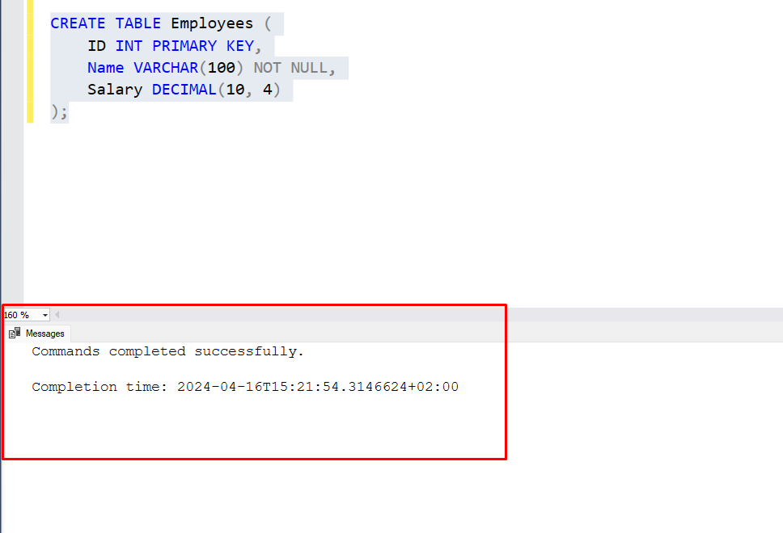

<hr/>

### 2. Add a new column named "Department" to the "Employees" table with data type varchar(50):
``` sql
ALTER TABLE Employees
ADD Department VARCHAR(50);
```
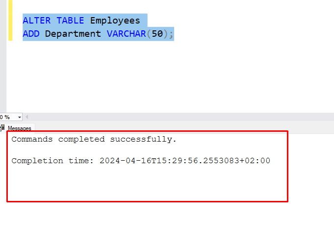
<hr/>

### 3. Remove the "Salary" column from the "Employees" table:
``` sql
ALTER TABLE Employees
DROP COLUMN Salary;
```
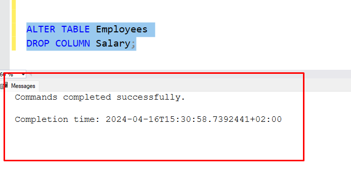
<hr/>


### 4. Rename the "Department" column in the "Employees" table to "DeptName":
```sql
EXEC sp_rename 'Employees.Department', 'DeptName';  
```
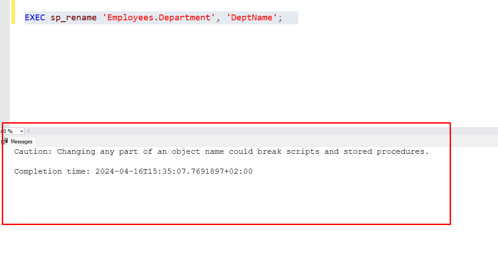

<hr/>

### 5. Create a new table called "Projects" with columns for ProjectID (integer) and ProjectName (varchar):

```sql
CREATE TABLE Projects (
    ProjectID INT PRIMARY KEY,
    ProjectName VARCHAR(100)
);
```
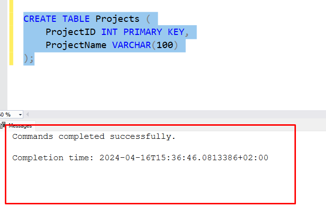

<hr/>

### 6. Add a primary key constraint to the "Employees" table for the "ID" column:
``` sql
ALTER TABLE Employees
ADD CONSTRAINT PK_Employees PRIMARY KEY (ID);
```
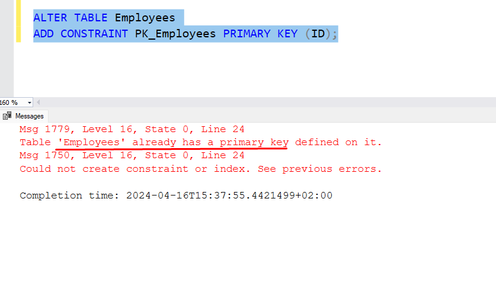

<hr/>

### 7. Add a unique constraint to the "Name" column in the "Employees" table:
``` sql
ALTER TABLE Employees
ADD CONSTRAINT UQ_Name UNIQUE (Name);
```
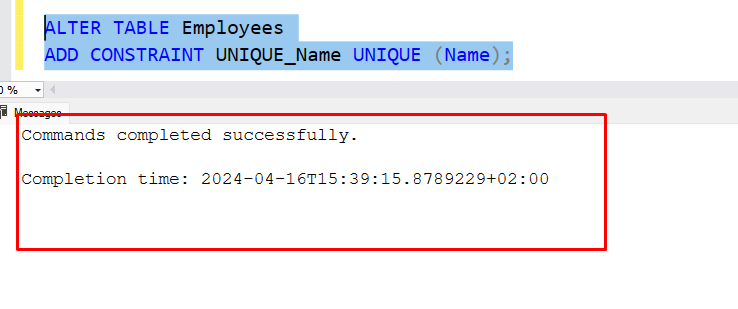

<hr/>

### 8.Create a table named "Customers" with columns for CustomerID (integer), FirstName (varchar), LastName (varchar), Email (varchar), and Status (varchar):

``` sql
CREATE TABLE Customers (
    CustomerID INT,
    FirstName VARCHAR(100),
    LastName VARCHAR(100),
    Email VARCHAR(100),
    Status VARCHAR(50)
);
```
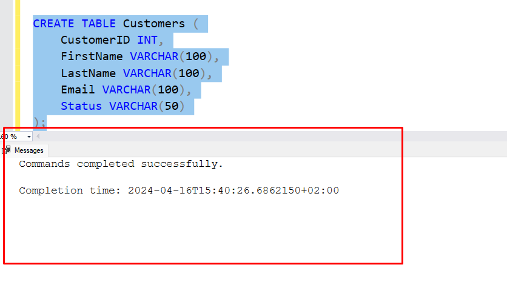

<hr/>

### 9. Add a unique constraint to the combination of "FirstName" and "LastName" columns in the "Customers" table:
```sql
ALTER TABLE Customers
ADD CONSTRAINT UNIQUE_COLS UNIQUE (FirstName, LastName);
```
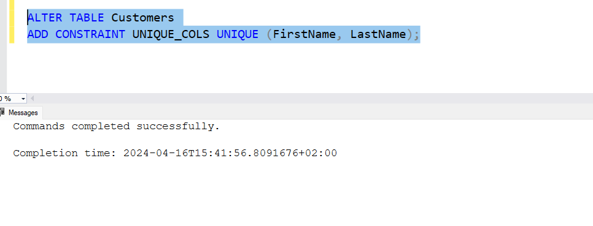

<hr/>

### 10. Create a table named "Orders" with columns for OrderID (integer), CustomerID (integer), OrderDate (datetime), and TotalAmount (decimal):

``` sql
CREATE TABLE Orders (
    OrderID INT,
    CustomerID INT,
    OrderDate DATETIME,
    TotalAmount DECIMAL(10, 2)
);
```
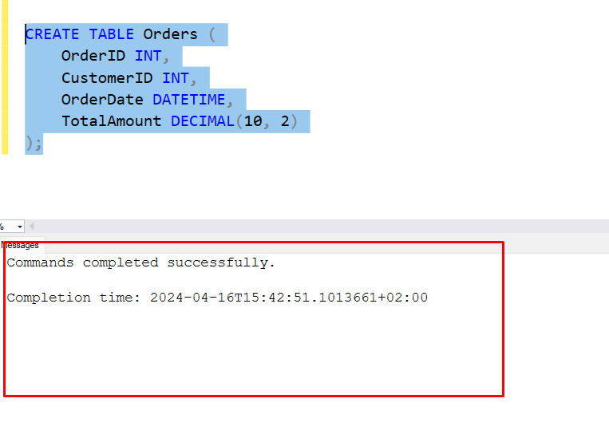

<hr/>

### 11. Add a check constraint to the "TotalAmount" column in the "Orders" table to ensure that it is greater than zero:
```sql
ALTER TABLE Orders
ADD CONSTRAINT CHK_TotalAmount CHECK (TotalAmount > 0);
```
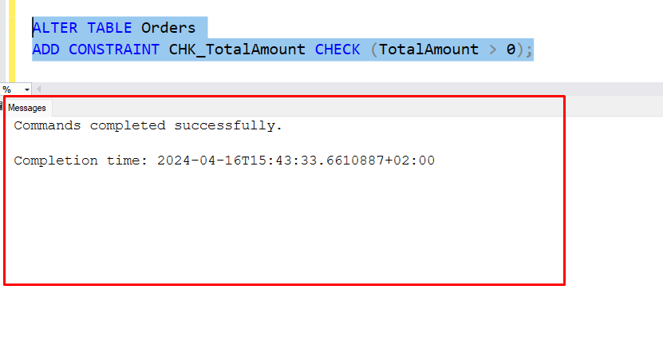

<hr />

### 12. Create a schema named "Sales" and move the "Orders" table into this schema:
``` sql
CREATE SCHEMA Sales;
ALTER SCHEMA Sales TRANSFER dbo.Orders;
```
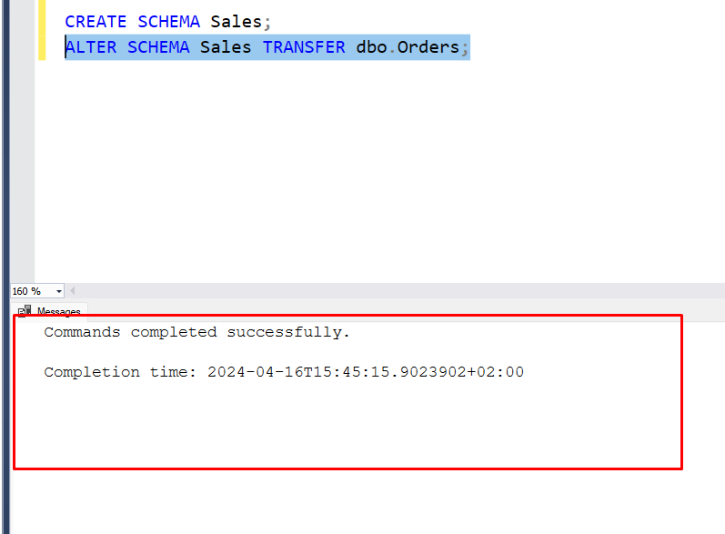

### 13.	Rename the "Orders" table to "SalesOrders."
```sql
EXEC sp_rename 'Sales.Orders', 'SalesOrders';
```
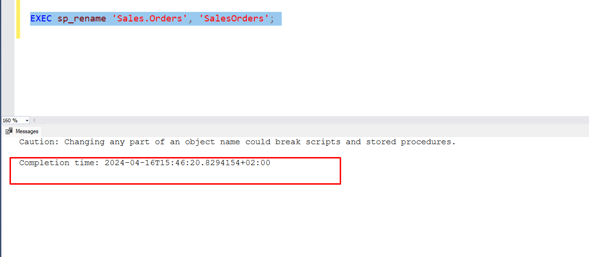