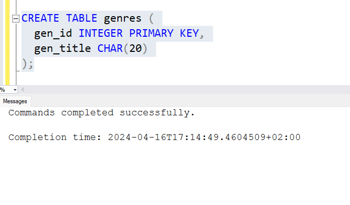

# DataBase Task
> Soloution For Image map to SQL

## Note
> Verify of Soloution will be found here [verifySoloution.md](https://github.com/fadyehabamer/DOTNET-COURSE/blob/main/Day-14/TASK%202%20IMAGE_TO_SQL/verifySoloution.md)

### Creating Database called FILM_PRODUCTION_COMPANIES
```sql
CREATE DATABASE FILM_PRODUCTION_COMPANIES;
```

### Creating 'actor' table
```sql
CREATE TABLE actor (
  act_id INTEGER PRIMARY KEY,
  act_fname CHAR(20),
  act_lname CHAR(20),
  act_gender CHAR(1)
);
```


---

### Creating 'director' table
```SQL
CREATE TABLE director (
  dir_id INTEGER PRIMARY KEY,
  dir_fname CHAR(20),
  dir_lname CHAR(20)
);
```


---

### Creating 'movie' table
```SQL
CREATE TABLE movie (
  mov_id INTEGER PRIMARY KEY,
  mov_title CHAR(50),
  mov_year INTEGER,
  mov_time INTEGER,
  mov_lang CHAR(50),
  mov_dt_rel DATE,
  mov_rel_country CHAR(5)
);
```


---

### Creating 'movie_cast' table
```SQL
CREATE TABLE movie_cast (
  act_id INTEGER,
  mov_id INTEGER,
  role CHAR(30),
  FOREIGN KEY (act_id) REFERENCES actor(act_id),
  FOREIGN KEY (mov_id) REFERENCES movie(mov_id)
);    
```


---

### Creating 'movie_direction' table
```SQL
CREATE TABLE movie_direction (
  dir_id INTEGER,
  mov_id INTEGER,
  FOREIGN KEY (dir_id) REFERENCES director(dir_id),
  FOREIGN KEY (mov_id) REFERENCES movie(mov_id)
);
```


---

### Creating 'reviewer' table
```SQL
CREATE TABLE reviewer (
  rev_id INTEGER PRIMARY KEY,
  rev_name CHAR(30)
);
```


---

### Creating 'genres' table
```SQL
CREATE TABLE genres (
  gen_id INTEGER PRIMARY KEY,
  gen_title CHAR(20)
);
```


---

### Creating 'movie_genres' table
```SQL
CREATE TABLE movie_genres (
  mov_id INTEGER,
  gen_id INTEGER,
  FOREIGN KEY (mov_id) REFERENCES movie(mov_id),
  FOREIGN KEY (gen_id) REFERENCES genres(gen_id)
);
```


--- 

### Creating 'rating' table
```SQL
CREATE TABLE rating (
  mov_id INTEGER,
  rev_id INTEGER,
  rev_stars INTEGER,
  num_o_ratings INTEGER,
  FOREIGN KEY (mov_id) REFERENCES movie(mov_id),
  FOREIGN KEY (rev_id) REFERENCES reviewer(rev_id)
);
```


---
