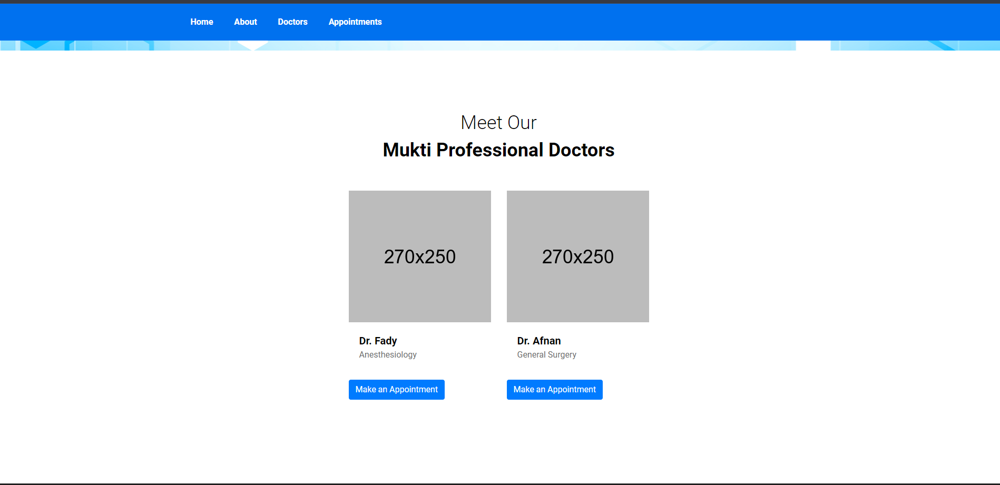
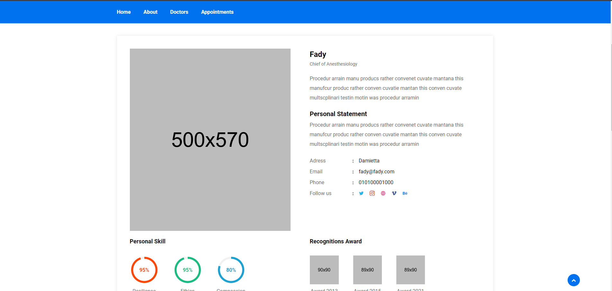
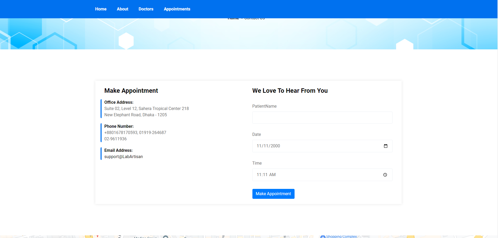
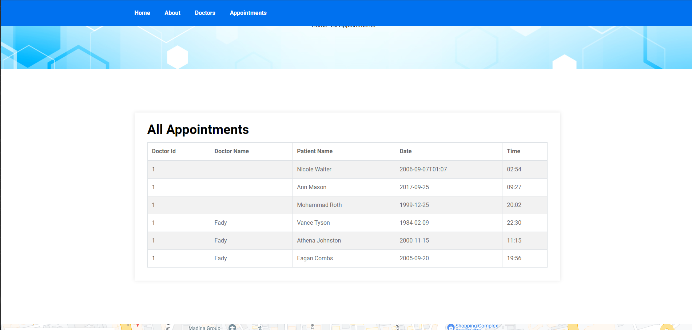

# Hospital Reservation System

## Overview

The Hospital Reservation System is a web application built using the .NET MVC framework and Entity Framework for backend functionality, with Bootstrap for the frontend design. This system allows users to view general information about the hospital, learn about the hospital, browse through a list of doctors, view details of individual doctors, make appointments, and list all appointments.

## Features

- **Home Page**: Displays general information about the hospital.
- **About Page**: Provides information about the hospital.
- **Doctors Page**: Retrieves and displays a list of doctors from the database.
- **Doctor Details Page**: Shows detailed information about a specific doctor.
- **Make Appointment Page**: Allows users to make an appointment with a doctor.
- **Appointment Page**: Lists all the appointments made.

## Technologies Used

- **Backend**: .NET MVC, Entity Framework
- **Frontend**: Bootstrap
- **Database**: SQL Server (used via Entity Framework)

## Project Structure

### Models

The models represent the data structure of the application. The primary models include:

- **Doctor**: Represents the doctors in the hospital.
- **Appointment**: Represents the appointments made by patients.

### Controllers

Controllers handle the user input and responses. The primary controllers include:

- **HomeController**: Handles requests for the Home and About pages.
- **DoctorsController**: Manages the display of doctors, doctor details, and appointment creation.
- **AppointmentController**: Manages the listing of appointments.

### Views

The views render the user interface. The primary views include:

- **/Index**: Displays general information about the hospital.
- **/About**: Displays information about the hospital.
- **Doctors/Index**: Displays a list of doctors retrieved from the database.
- **Doctors/Details**: Shows details for a specific doctor.
- **Doctors/MakeAppointment**: Provides a form for making an appointment with a doctor.
- **Appointment/Index**: Lists all appointments.

## Routes

The application uses the following routes:

- **Home**
  - `/`: Displays the home page with general information about the hospital.
- **About**
  - `/about`: Displays the about page with information about the hospital.
- **Doctors**
  - `/doctors`: Displays a list of doctors.
  - `/doctors/details/{id}`: Displays details for a specific doctor identified by `{id}`.
  - `/doctors/makeappointment/{id}`: Displays a form to make an appointment with a specific doctor identified by `{id}`.
- **Appointments**
  - `/appointment`: Displays a list of all appointments.

## Setup Instructions

1. **Clone the repository**:
   ```sh
   git clone <repository-url>
   ```

2. **Restore packages**:
   ```sh
   dotnet restore
   ```

3. **Update database**:
   ```sh
   dotnet ef database update
   ```

4. **Run the application**:
   ```sh
   dotnet run
   ```

## Screenshots

### Home Page


### About Page


### Doctors List


### Doctor Details


### Make Appointment


### Appointments List


## Contributing

1. Fork the repository.
2. Create a feature branch.
3. Commit your changes.
4. Push to the branch.
5. Create a new Pull Request.

## License

This project is licensed under the MIT License. See the LICENSE file for details.
