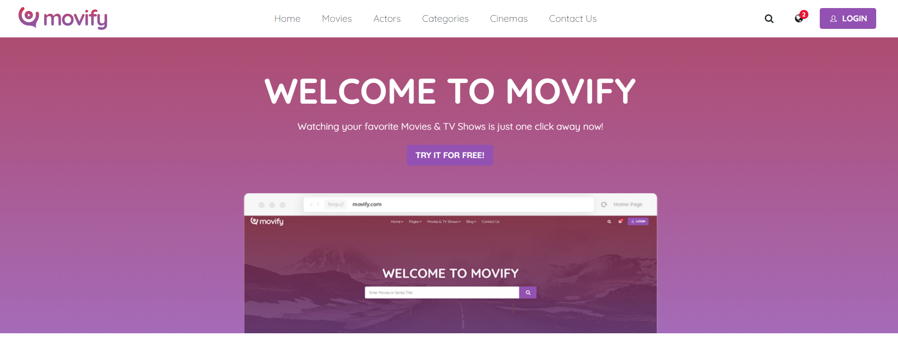

# Movify
#### Movify is an web application the allow you for now view data about films , cinemas and actors with all relations between them

### Controllers
- ActorController.cs:
    - Manages actor-related actions. Uses the ActorRepository to interact with actor data.
- CategoryController.cs:
    - Manages category-related actions. Uses the CategoryRepository to interact with category data.
- CinemaController.cs: 
    - Manages cinema-related actions. Uses the CinemaRepository to interact with cinema data.
- HomeController.cs: 
    - Manages the homepage and other static pages.
- MovieController.cs:
    - Manages movie-related actions. Uses the MovieRepository to interact with movie data, including a search functionality.

### Repository Design Pattern
    - The repository design pattern is implemented in this project to promote a clean separation of concerns. Each repository interface defines methods for accessing the data, and the corresponding repository class implements these methods.

### Models
- Actor.cs: Defines the Actor entity.
- ActorMovies.cs: Defines the many-to-many relationship between Actor and Movie.
- Category.cs: Defines the Category entity.
- Cinema.cs: Defines the Cinema entity.
- ErrorViewModel.cs: Defines the error view model.
- Movie.cs: Defines the Movie entity.

### Repository
- IRepository: Contains repository interfaces for dependency injection.
- ActorRepository.cs: Implements IActorRepository.
- CategoryRepository.cs: Implements ICategoryRepository.
- CinemaRepository.cs: Implements ICinemaRepository.
- MovieRepository.cs: Implements IMovieRepository.

### ViewModels
- Contains view models used to pass data between controllers and views.

### Views
- Contains the Razor views for each entity and shared views.

### Data
- ApplicationDbContext.cs: Configures the Entity Framework Core context.

### Usage of Search Functionality
- The search bar in the navbar allows users to search for movies by name.
